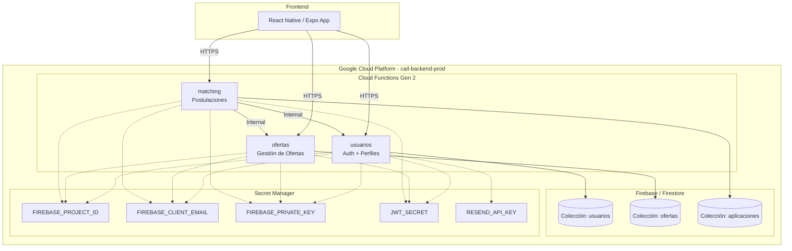
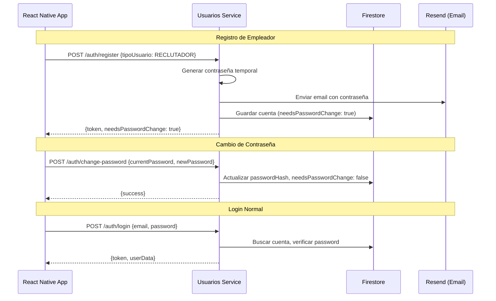

# Resumen Completo: Migración a Microservicios CAIL

## 📋 Resumen Ejecutivo

Se realizó la migración completa del backend monolítico de CAIL a una arquitectura de microservicios desplegados en **Google Cloud Functions (Gen 2)**. El frontend móvil (React Native/Expo) fue actualizado para comunicarse directamente con los nuevos servicios en la nube.

---

## 🏗️ Arquitectura Resultante



---

## 📁 Estructura del Proyecto

```
cail/
├── App.tsx                          # Punto de entrada React Native
├── src/
│   ├── screens/                     # Pantallas de la aplicación
│   │   ├── auth/                    # Login, Register, ChangePassword
│   │   ├── candidate/               # Panel del postulante
│   │   └── employer/                # Panel del empleador
│   └── services/
│       ├── api.service.ts           # Cliente HTTP con routing dinámico
│       ├── auth.service.ts          # Servicios de autenticación
│       ├── config.ts                # URLs de producción
│       └── user.service.ts          # Servicios de usuario
│
├── functions/                       # 🆕 Microservicios (Cloud Functions)
│   ├── usuarios/                    # Autenticación y perfiles
│   │   ├── src/
│   │   │   ├── auth/                # Dominio de autenticación
│   │   │   │   ├── application/     # Casos de uso
│   │   │   │   ├── domain/          # Entidades y repositorios
│   │   │   │   └── infrastructure/  # Controllers, routes, repos
│   │   │   ├── users/               # Dominio de usuarios
│   │   │   ├── shared/              # Middleware, utils
│   │   │   └── config/              # Firebase, env
│   │   └── package.json
│   │
│   ├── ofertas/                     # Gestión de ofertas laborales
│   │   └── src/
│   │       ├── ofertas/             # Dominio de ofertas
│   │       └── shared/
│   │
│   └── matching/                    # Postulaciones y matching
│       └── src/
│           ├── matching/            # Dominio de aplicaciones
│           └── shared/
│
├── shared/
│   └── cail-common/                 # 🆕 Librería compartida
│       └── src/
│           ├── types/               # DTOs compartidos
│           └── infrastructure/      # JWT util, response util
│
├── scripts/
│   ├── deploy.ps1                   # Script de despliegue
│   └── setup-secrets.ps1            # Configuración de secretos
│
├── .github/workflows/
│   └── deploy.yml                   # CI/CD con GitHub Actions
│
├── cloudbuild.yaml                  # Configuración Cloud Build
└── wso2/                            # Definiciones API (futuro)
    └── api-definitions/
```

---

## 🔗 URLs de Producción

| Servicio | URL |
|----------|-----|
| **Usuarios** | `https://us-central1-cail-backend-prod.cloudfunctions.net/usuarios` |
| **Ofertas** | `https://us-central1-cail-backend-prod.cloudfunctions.net/ofertas` |
| **Matching** | `https://us-central1-cail-backend-prod.cloudfunctions.net/matching` |

---

## 🔐 Endpoints Implementados

### Microservicio: Usuarios
| Método | Endpoint | Descripción | Auth |
|--------|----------|-------------|------|
| POST | `/auth/register` | Registro de usuario (candidato/empleador) | ❌ |
| POST | `/auth/login` | Inicio de sesión | ❌ |
| POST | `/auth/change-password` | Cambio de contraseña | ✅ |
| POST | `/auth/validate-token` | Validación de JWT | ✅ |
| GET | `/users/profile` | Obtener perfil del usuario | ✅ |
| PUT | `/users/profile` | Actualizar perfil | ✅ |
| GET | `/users/:id` | Obtener usuario por ID | ✅ |
| GET | `/health` | Health check | ❌ |

### Microservicio: Ofertas
| Método | Endpoint | Descripción | Auth |
|--------|----------|-------------|------|
| GET | `/ofertas` | Listar ofertas | ✅ |
| POST | `/ofertas` | Crear oferta | ✅ (Reclutador) |
| GET | `/ofertas/:id` | Detalle de oferta | ✅ |
| PUT | `/ofertas/:id` | Actualizar oferta | ✅ (Reclutador) |
| DELETE | `/ofertas/:id` | Eliminar oferta | ✅ (Reclutador) |
| GET | `/health` | Health check | ❌ |

### Microservicio: Matching
| Método | Endpoint | Descripción | Auth |
|--------|----------|-------------|------|
| POST | `/aplicaciones` | Crear postulación | ✅ (Postulante) |
| GET | `/aplicaciones/postulante/:id` | Aplicaciones del postulante | ✅ |
| GET | `/aplicaciones/oferta/:id` | Aplicaciones por oferta | ✅ (Reclutador) |
| GET | `/health` | Health check | ❌ |

---

## 🛠️ Trabajo Realizado

### Fase 1: Análisis y Planificación
- ✅ Análisis del monolito existente (`backend/`)
- ✅ Identificación de dominios: Auth, Usuarios, Ofertas, Matching
- ✅ Diseño de arquitectura basada en DDD (Domain-Driven Design)
- ✅ Planificación de migración tipo "Strangler Fig"

### Fase 2: Creación de Microservicios
- ✅ Scaffolding de 3 Cloud Functions con estructura hexagonal
- ✅ Implementación de entidades, value objects y repositorios
- ✅ Casos de uso: Register, Login, ChangePassword, CRUD Ofertas, Aplicaciones
- ✅ Middleware de autenticación JWT
- ✅ Middleware de manejo de errores global
- ✅ Configuración de CORS para producción

### Fase 3: Infraestructura Cloud
- ✅ Configuración del proyecto GCP `cail-backend-prod`
- ✅ Habilitación de APIs: Cloud Functions, Cloud Build, Secret Manager, Artifact Registry
- ✅ Creación de secretos en Secret Manager (5 secretos)
- ✅ Configuración de permisos IAM para Cloud Run service account
- ✅ Despliegue de las 3 funciones a `us-central1`

### Fase 4: Integración Frontend
- ✅ Refactorización de [ApiService](file:///c:/Users/carlo/Desktop/cail/cail/src/services/api.service.ts#8-134) para routing dinámico multi-servicio
- ✅ Actualización de [config.ts](file:///c:/Users/carlo/Desktop/cail/cail/src/services/config.ts) con URLs de producción
- ✅ Eliminación de rutas legacy (`/api/v1`)
- ✅ Commit y push a rama `cdm18`

### Fase 5: Depuración de Producción
- ✅ Corrección de secretos con caracteres invisibles (newlines)
- ✅ Apertura de CORS (`*`) para tráfico móvil
- ✅ Verificación de health checks en producción
- ✅ Validación de flujo de registro y cambio de contraseña

---

## ⚙️ Configuración de Secretos

| Secreto | Descripción |
|---------|-------------|
| `FIREBASE_PROJECT_ID` | ID del proyecto Firebase |
| `FIREBASE_CLIENT_EMAIL` | Email de la cuenta de servicio |
| `FIREBASE_PRIVATE_KEY` | Clave privada RSA (sin comillas) |
| `JWT_SECRET` | Secreto para firmar tokens JWT |
| `RESEND_API_KEY` | API Key de Resend para emails |

---

## 📦 Dependencias Principales

| Paquete | Versión | Uso |
|---------|---------|-----|
| `express` | ^4.21.2 | Framework HTTP |
| `firebase-admin` | ^13.0.2 | SDK de Firebase |
| `jsonwebtoken` | ^9.0.2 | Generación/verificación JWT |
| `bcryptjs` | ^2.4.3 | Hash de contraseñas |
| `cors` | ^2.8.5 | Control de acceso HTTP |
| `resend` | ^4.0.0 | Envío de emails (contraseña temporal) |
| `@google-cloud/functions-framework` | ^3.4.5 | Runtime de Cloud Functions |

---

## 🔄 Flujo de Autenticación



---

## 📊 Estado Actual

| Componente | Estado | Notas |
|------------|--------|-------|
| Registro Postulante | ✅ Operativo | |
| Registro Empleador | ✅ Operativo | Email con contraseña temporal |
| Login | ✅ Operativo | |
| Cambio Contraseña | ✅ Operativo | Corregido CORS y JWT |
| Health Checks | ✅ Operativo | Todos responden 200 |
| Frontend Vinculado | ✅ Operativo | Rama `cdm18` |
| CI/CD | ⚠️ Configurado | Pendiente prueba automática |

---

## 🚀 Próximos Pasos Recomendados

1. **Testing E2E**: Implementar pruebas de integración automatizadas
2. **WSO2 Gateway**: Configurar API Gateway para rate limiting y analytics
3. **Monitoring**: Configurar alertas en Cloud Monitoring
4. **Seguridad**: Restringir CORS a dominios específicos una vez estabilizado
5. **CI/CD**: Activar GitHub Actions para despliegue automático en push

---

## 📝 Comandos Útiles

```powershell
# Ver logs de una función
gcloud functions logs read usuarios --region=us-central1 --limit=20

# Redesplegar una función
gcloud functions deploy usuarios --gen2 --runtime=nodejs20 --region=us-central1 --source=functions/usuarios --entry-point=usuarios --trigger-http --allow-unauthenticated

# Ver estado de los servicios
gcloud functions list --region=us-central1

# Acceder a un secreto
gcloud secrets versions access latest --secret="JWT_SECRET"
```

---

*Documento generado el 2026-01-07*
